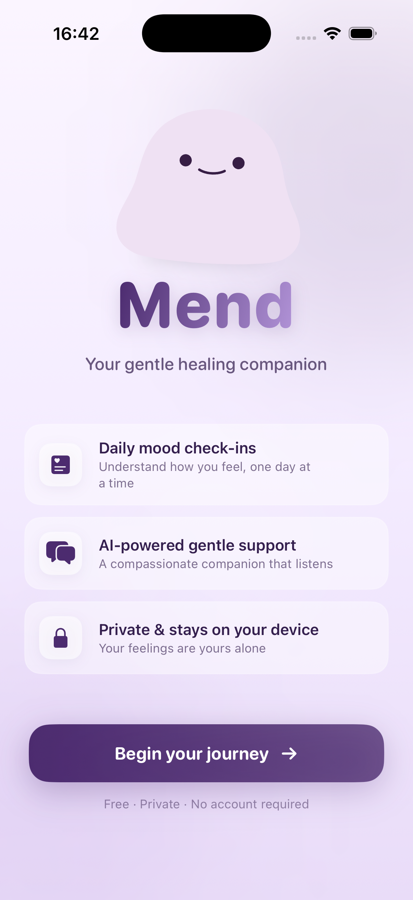
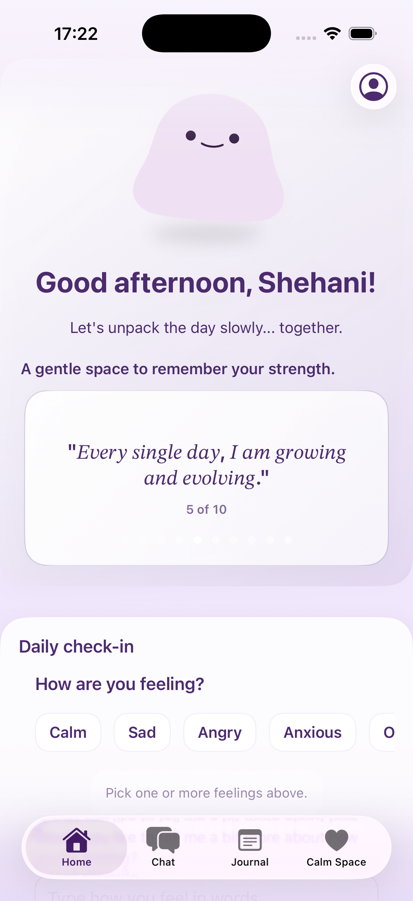
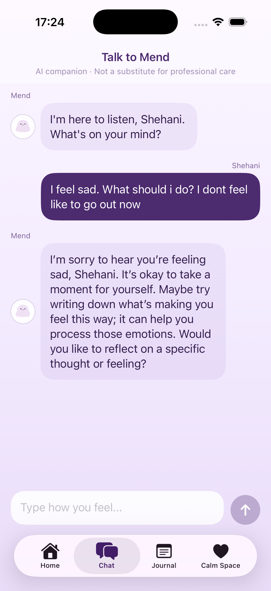
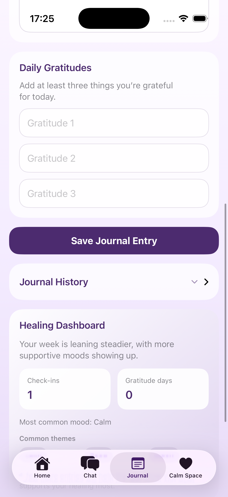

# Hi, I'm Shehani 👋

> Aspiring **iOS Developer** passionate about building clean, scalable, and user-friendly applications with modern design patterns.

Currently crafting iOS apps and deepening my expertise in **Swift** and **SwiftUI** to deliver polished, production-ready experiences. 🎯

### 📱 [Healing Tracker]
*A fully-featured, native iOS application built completely from scratch.*
* **[Link to Repository](https://github.com/shehanish/your-repo-name)**
* **Tech Stack:** SwiftUI, Swift Concurrency (async/await), MVVM Architecture, [e.g., CoreData / URLSession]

  
  

*Mend is a private, local-first iOS wellness app for people who want a softer place to process their feelings. It combines daily mood check-ins, AI-powered reflections, a guided journal, and a calm space for moments of anxiety — all stored privately on your device.

  
  

* **Key Features:** AI-powered emotional companion, no-contact counter tracker, Panic Room with guided breathing & grounding techniques
* **What I Learned:** Privacy-first mental health app, secure on-device data handling, real-time AI conversations, interactive UI design

### 🎓 [Name of Your 42 Advanced iOS Project]
*An advanced mobile application developed as part of the 42 specialized curriculum.*
* **[Link to Repository](https://github.com/shehanish/your-repo-name)**
* **Tech Stack:** [SwiftUI / UIKit], [Architecture, e.g., MVVM or MVC], Git
* **Key Features:** [e.g., Multi-view navigation, authentication flow, parsing complex JSON structures]
* **The 42 Challenge:** Built entirely without standard tutorials, relying purely on official Apple documentation and peer code reviews.

### 📱 Mend
*A fully-featured, native iOS application for emotional wellness and breakup recovery, built completely from scratch.*
* **[Repository](https://github.com/shehanish/Breakup_tracker)** | **Tech Stack:** SwiftUI, Swift Concurrency, MVVM, SwiftData, OpenAI API
* **Key Features:** AI-powered emotional companion, no-contact counter tracker, Panic Room with guided breathing & grounding techniques
* **What I Learned:** Privacy-first mental health app, secure on-device data handling, real-time AI conversations, interactive UI design

---

### 🎓 Swifty Companion
*An advanced native iOS application developed as part of the 42 specialized curriculum.*
* **[Repository](https://github.com/shehanish/Swifty-Companion)** | **Tech Stack:** SwiftUI, MVVM, Swift 6, OAuth2
* **Key Features:** OAuth2 authentication with 42 API, real-time peer search, dynamic progress visualization, responsive multi-view navigation
* **The 42 Challenge:** Built without standard tutorials, relying on official Apple documentation and peer code reviews

---

## Other Projects

| Project | Description | Links |
|---------|-------------|-------|
| **📝 SmartNotes** | Fast note-taking iOS app with clean organization and optional cross-device syncing. | [Repo](https://github.com/shehanish/SmartNotes) |
| **🎮 Transcendence** | Full-stack collaborative project showcasing end-to-end delivery and system design. | [Repo](https://github.com/mdomnik/Transcendence) |
| **⚙️ CPP09** | C++ project demonstrating OOP, algorithms, and problem solving. | [Repo](https://github.com/shehanish/cpp09) |
| **🐳 Inception** | Docker-based service orchestration and infrastructure setup. | [Repo](https://github.com/shehanish/inception) |
| **🚀 Upcoming iOS Apps** | Currently designing and building new iOS applications (repos coming soon). | — |

## Tech Stack
- **iOS:** Swift, SwiftUI, UIKit, Concurrency (async/await)
- **Languages:** C, C++, Swift
- **Backend / Web:** REST APIs, authentication, client/server architecture
- **DevOps / Infra:** Docker, Docker Compose, containers, networking
- **Tools:** Git & GitHub, Linux, Makefiles, shell basics, Xcode
- **Core CS:** OOP, debugging, problem solving, clean code practices

## What I'm working on
- Building and shipping my own iOS apps (SwiftUI + modern iOS patterns)
- Improving iOS fundamentals: **architecture (MVVM)**, networking, persistence (**Core Data / SwiftData**), and testing

## Contact
- LinkedIn: [shehani-hansi](https://www.linkedin.com/in/shehani-hansi/)
- Email: [shehani1207@gmail.com](mailto:shehani1207@gmail.com)
